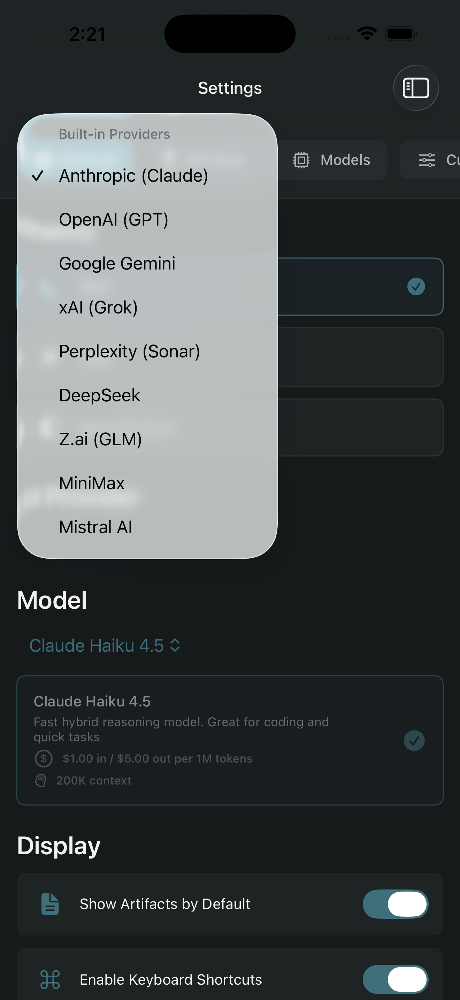
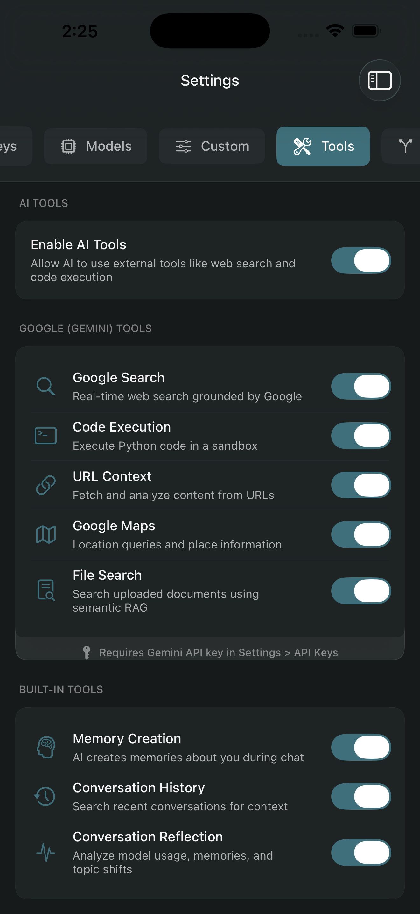
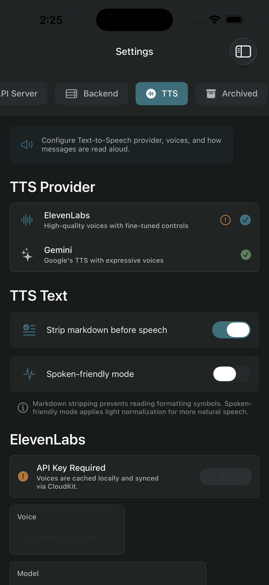

# Axon

A local-first AI orchestration assistant for iOS and macOS. Connect to multiple AI providers, run models on-device with MLX, have real-time voice conversations, and bridge to VS Code for AI-assisted coding — all with persistent memory and privacy by default.

[](LICENSE)
[]()
[]()

---

## Screenshots

<p align="center">
  
  
  
  
</p>

---

## Features

### Multi-Provider AI
- Supports **Anthropic Claude**, **OpenAI GPT**, **Google Gemini**, **Perplexity**, **DeepSeek**, **xAI Grok**, **Mistral**, **Z.ai**, and **MiniMax**
- Unified conversation model — switch providers mid-conversation
- Per-message model selection with cost tracking

### On-Device Models (MLX)
- Run quantized LLMs locally via Apple MLX (no API key required)
- Integrated Hugging Face model browser
- Supports Gemma 3 and other MLX-compatible models

### Persistent Memory
- Automatic memory extraction across conversations
- Salience scoring (EpistemicEngine) for relevance ranking
- iCloud sync across devices

### Live Mode (Real-Time Voice)
- Full-duplex voice conversation with AI
- Kokoro on-device TTS for low-latency responses
- ElevenLabs integration for high-quality synthesis

### Axon Bridge (VS Code Extension)
- Connect VS Code to Axon for AI-assisted coding
- Read, write, and run code in your VS Code workspace from Axon
- LAN and TLS-secured remote connections
- Included in `axon-bridge-vscode/`

### Agent Orchestration
- Sub-agent jobs with lifecycle management (propose, approve, execute)
- Memory silos for scoped agent context
- Sovereignty signing for agent-authored content

### Generative UI
- Render dynamic SwiftUI views from AI-generated JSON descriptors
- Artifact system for structured AI outputs (code, documents, data)

### Privacy First
- Local-first: no account required, conversations stored on-device
- App lock with biometric authentication
- Encrypted conversation storage
- Optional iCloud sync and optional cloud backend

---

## Requirements

| Requirement | Version |
|-------------|---------|
| Xcode | 16.0+ |
| iOS deployment target | 17.0+ |
| macOS deployment target | 14.0+ |
| Swift | 6.0 |
| Apple Developer account | Required for device builds; free tier works for simulator |

---

## Getting Started

### 1. Clone

```bash
git clone https://github.com/theMethodolojeeOrg/Axon.git
cd Axon
```

### 2. Axon-Artifacts Package (Required)

Axon depends on the `Axon-Artifacts` Swift package, which can be found at https://github.com/theMethodolojeeOrg/Axon-Artifacts. 

### 3. Open in Xcode

```bash
open Axon.xcodeproj
```

Xcode will resolve SPM packages automatically on first open. This may take a minute.

### 4. Set Your Development Team

In **Signing & Capabilities**, set your Apple Developer Team for all targets (Axon, AxonTests, AxonUITests, AxonLiveActivity).

### 5. iCloud and App Group Identifiers

The entitlements contain identifiers tied to the original developer's Apple account. You must change these to identifiers registered under your own team:

- iCloud container: `iCloud.NeurXAxon` — your own container
- App group: `group.com.e2a0f78c018434b3.Axon` — your own group

These values appear in several Swift files. See [CONTRIBUTING.md](CONTRIBUTING.md) for the full list of files to update.

### 6. Firebase / Cloud Backend (Optional)

Cloud features are optional. To use them:

```bash
cp Axon/Config/PublicConfig.example.plist Axon/Config/PublicConfig.local.plist
# Edit PublicConfig.local.plist with your Firebase API key and App ID
```

Never commit `PublicConfig.local.plist`.

### 7. TTS Voices (Required for Kokoro TTS)

```bash
python3 create_voices_builtin.py
```

This generates `Axon/Resources/KokoroTTS/Voices/voices_builtin.npz`. The file is excluded from source control due to size.

### 8. Build

Press `Cmd+B` in Xcode.

---

## Architecture

```
Axon/
├── AxonApp.swift               # App entry point, scene lifecycle
├── Config/                     # Build configuration, backend config
├── Models/                     # Core data models (Conversation, Message, Memory...)
├── ViewModels/                 # ObservableObject view models
├── Views/                      # SwiftUI views by feature area
│   ├── Chat/
│   ├── Live/                   # Live Mode (voice)
│   ├── Memory/
│   ├── Settings/
│   └── Workspaces/
├── Services/                   # Business logic, organized by domain
│   ├── AgentOrchestrator/      # Sub-agent job lifecycle
│   ├── API/                    # HTTP client, bridge client
│   ├── Auth/                   # Biometric auth, app lock
│   ├── Bridge/                 # VS Code bridge protocol and server
│   ├── Conversation/           # Conversation CRUD, sync, orchestration
│   ├── Encryption/             # At-rest encryption
│   ├── Federation/             # Multi-device discovery (SARA protocol)
│   ├── Identity/               # AIP (AI Addressing Protocol), user zones
│   ├── LocalModels/            # MLX on-device model runner
│   ├── Logging/                # DebugLogger (category-filtered, off by default)
│   ├── Memory/                 # Epistemic engine, salience, learning loop
│   ├── Models/                 # Model registry, configuration
│   ├── Sovereignty/            # Covenant negotiation, integrity verification
│   ├── Sync/                   # iCloud/CloudKit sync
│   └── ...
├── Extensions/
│   └── ArtifactConvenience.swift  # Axon-Artifacts convenience API
└── Resources/
    ├── KokoroTTS/              # On-device TTS voices
    ├── MLXModels/              # Bundled MLX model configs and tokenizers
    └── AxonTools/              # Tool plugin manifests

axon-bridge-vscode/             # VS Code extension (TypeScript)
assets/                         # Screenshots and logos
```

### Key Patterns

- **Local-first with optional cloud.** Conversations and memories are stored on-device in Core Data. iCloud sync (CloudKit) is opt-in. No backend account is required.
- **Provider abstraction.** `APIClient` and `ConversationOrchestrator` abstract over multiple AI providers. Provider-specific logic lives in `Services/Models/`.
- **Swift 6 strict concurrency.** All services use explicit actor isolation. `@MainActor` on view models and UI-driving services. Background services use structured concurrency.

---

## Known Issues

- `swift-huggingface` is pinned to a [personal fork](https://github.com/tooury/swift-huggingface) — migration to upstream planned
- `Axon-Artifacts` is a local SPM package — being split into its own public repo
- iCloud/app group identifiers are hardcoded — centralization planned
- Bare `print()` calls in Services are silenced in release builds; migration to `debugLog()` is ongoing

---

## VS Code Bridge

The `axon-bridge-vscode/` directory contains the companion VS Code extension. See [axon-bridge-vscode/README.md](axon-bridge-vscode/README.md) for installation and usage.

---

## Contributing

See [CONTRIBUTING.md](CONTRIBUTING.md) for setup instructions, code style, and how to submit pull requests.

---

## License

MIT — see [LICENSE](LICENSE).

Copyright 2025 Thomas Oury / methodolojee
