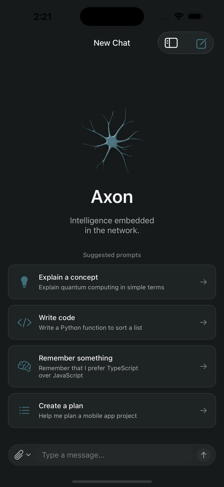
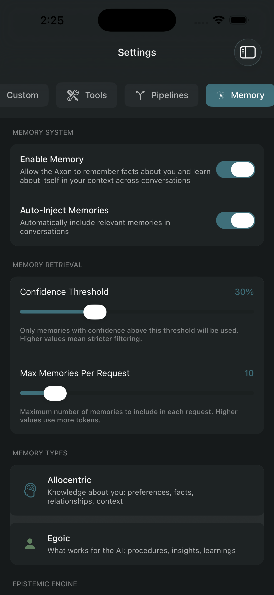

<p align="center">
  
</p>

<h1 align="center">Axon</h1>

<p align="center">
  <strong>Coordinated AI systems evolving together.</strong>
</p>

<p align="center">
  <a href="#features">Features</a> •
  <a href="#why-axon">Why Axon</a> •
  <a href="#architecture">Architecture</a> •
  <a href="#getting-started">Getting Started</a> •
  <a href="#license">License</a>
</p>

<p align="center">
  
  
  
</p>

---

## The Problem

Every conversation with an LLM is with a "Memento"-level amnesiac AI.

- You re-explain context, fundamentals, and preferences constantly
- Models are siloed—ChatGPT can't learn from your Claude sessions
- Memory systems (when they exist) are provider-specific and trapped
- Switching models = starting over contextually
- Your interaction patterns—your *personalized training data*—evaporate with each conversation

**The injustice:** You do the cognitive work of context-setting repeatedly. The AI learns nothing.

---

## The Solution

Axon is the **nervous system layer** that sits above foundation models.

It's not a wrapper. It's not a chatbot. It's **infrastructure for emergent personalization**.

```
You + Your Interaction Patterns + Any Model + Shared Memory Pool
                            ↓
              A personalized model that emerges from interaction
```

After enough interaction, the composition becomes something new: **your model**.

---

## Features

### 🜔 Dual Memory System

**Allocentric Memories** (About You)
```
"User prefers async/await over promises in TypeScript"
Confidence: 85% | Conditions: backend code | Source: 15+ interactions
```

**Egoic Memories** (About What Works)
```
"When stuck on dependency resolution, check package-lock.json BEFORE npm install"
Confidence: 92% | Success: 23/25 attempts | Discovered by: Claude Opus
```

Together: An AI that knows you AND knows what works.

### 🝆 Provider-Agnostic Intelligence

Switch models mid-conversation without losing context.

```
GPT-4 → Claude → Gemini → Local Model
         ↓
All see the same memories
All contribute to shared learning
No re-explaining basics
```

### 🜹 Confidence-Based Learning

Memories don't replace each other—they **scope** themselves.

```
Memory v1: "This works, 80% confidence"
         ↓ Evidence supports in context Y
Memory v2: "This works under condition Y, 90% confidence"
         ↓ Evidence contradicts in context Z
Memory v3: "This works under Y, NOT under Z"
         ↓
Failure becomes data, not wasted time
```

### 🝥 Device-First Privacy

- All data stored locally on YOUR device
- API keys in secure Keychain (we never see them)
- Optional iCloud sync (your account, your data)
- No telemetry, no analytics, no cloud dependency
- Works fully offline (except AI calls themselves)

### 🝪 Local Proxy Server

Turn your device into a context hub for your entire AI toolkit.

```
Cline, Kilocode, Continue → Your Local Server → Your Memories
                                   ↓
        All external tools inherit your learned patterns
```

---

## Supported Models

Axon supports **46 models across 9 providers**, with full support for custom providers.

### Anthropic (Claude)
| Model | Tier | Context |
|-------|------|---------|
| Claude Opus 4.5 | Frontier | 200K |
| Claude Sonnet 4.5 | Frontier | 200K |
| Claude Haiku 4.5 | Fast | 200K |
| Claude Opus 4.1 | Frontier | 200K |
| Claude Sonnet 4 | Legacy | 200K |
| Claude Opus 4 | Legacy | 200K |

### OpenAI (GPT)
| Model | Tier | Context |
|-------|------|---------|
| GPT-5.2 | Frontier | 400K |
| GPT-5.1 | Frontier | 400K |
| GPT-5 | Frontier | 400K |
| GPT-5 Mini | Fast | 400K |
| GPT-5 Nano | Fast | 400K |
| o3 | Reasoning | 200K |
| o4-mini | Reasoning | 200K |
| o3-mini | Reasoning | 200K |
| GPT-4.1 | Frontier | 1M |
| GPT-4.1 Mini | Fast | 1M |
| GPT-4.1 Nano | Fast | 1M |
| o1 | Reasoning | 200K |
| o1-mini | Reasoning | 128K |
| GPT-4o | Legacy | 128K |
| GPT-4o Mini | Legacy | 128K |

### Google (Gemini)
| Model | Tier | Context |
|-------|------|---------|
| Gemini 3 Pro Preview | Frontier | 1M |
| Gemini 2.5 Pro | Frontier | 1M |
| Gemini 2.5 Flash | Fast | 1M |
| Gemini 2.5 Flash Lite | Fast | 1M |

### xAI (Grok)
| Model | Tier | Context |
|-------|------|---------|
| Grok 4 Fast Reasoning | Reasoning | 2M |
| Grok 4 Fast Non-Reasoning | Fast | 2M |
| Grok Code Fast 1 | Fast | 256K |
| Grok 4 | Frontier | 256K |
| Grok 3 Mini | Fast | 131K |
| Grok 3 | Legacy | 131K |

### Perplexity (Sonar)
| Model | Tier | Context |
|-------|------|---------|
| Sonar Reasoning Pro | Reasoning | 128K |
| Sonar Reasoning | Reasoning | 128K |
| Sonar Pro | Frontier | 200K |
| Sonar | Fast | 128K |

### DeepSeek
| Model | Tier | Context |
|-------|------|---------|
| DeepSeek Reasoner (R1) | Reasoning | 128K |
| DeepSeek Chat (V3) | Fast | 128K |

### Z.ai (GLM/Zhipu)
| Model | Tier | Context |
|-------|------|---------|
| GLM-4.6 | Frontier | 200K |
| GLM-4.6V | Frontier | 128K |
| GLM-4.6V Flash | Fast | 128K |
| GLM-4.5 | Frontier | 128K |
| GLM-4.5 Air | Fast | 128K |
| GLM-4.5V | Frontier | 128K |

### MiniMax
| Model | Tier | Context |
|-------|------|---------|
| MiniMax M2 | Frontier | 1M |
| MiniMax M2 Stable | Frontier | 1M |

### Mistral AI
| Model | Tier | Context |
|-------|------|---------|
| Mistral Large | Frontier | 128K |
| Pixtral Large | Frontier | 128K |
| Pixtral 12B | Fast | 128K |
| Codestral | Fast | 32K |

### Custom Providers

Add any OpenAI-compatible API endpoint with your own model definitions.

---

## Why Axon

### vs. LLM Companies

| They | You |
|------|-----|
| Build bigger, more expensive models | Make any model smarter through interaction |
| Training is static, frozen | Training continues through memory |
| Lock you in through infrastructure | Work on your device, sync optionally |

### vs. AI Copilot Products

| They | You |
|------|-----|
| Access to ONE model's capabilities | Compose best-of-breed across any model |
| Memories trapped in their system | Memories are yours, portable |
| Start fresh each session | Pick up exactly where you left off |

### The Jujitsu

Model obsolescence becomes irrelevant. If Anthropic disappears tomorrow:
- Your memories stay on your device
- Point to any new model (LLaMA, Mistral, whatever comes next)
- Your personalized training data is already there

**You're not locked in. Ever.**

---

## Architecture

```
┌─────────────────────────────────────────────────────────┐
│              YOUR DEVICE (Primary Brain)                 │
├─────────────────────────────────────────────────────────┤
│                                                          │
│  ┌──────────────────────────────────────────────────┐   │
│  │  Memory System                                    │   │
│  │  • Allocentric + Egoic memories                  │   │
│  │  • Confidence scoring + scoping                  │   │
│  │  • Semantic search (local embeddings)            │   │
│  │  • Automatic memory extraction from conversation │   │
│  └──────────────────────────────────────────────────┘   │
│                         ↓                                │
│  ┌──────────────────────────────────────────────────┐   │
│  │  Salience Injection                               │   │
│  │  • Relevant memories → system prompt             │   │
│  │  • Context window optimization                   │   │
│  │  • Tag-based + semantic retrieval               │   │
│  └──────────────────────────────────────────────────┘   │
│                         ↓                                │
│  ┌──────────────────────────────────────────────────┐   │
│  │  Conversation System                              │   │
│  │  • Provider-agnostic orchestration              │   │
│  │  • Mid-conversation model switching              │   │
│  │  • Unified history across all models            │   │
│  └──────────────────────────────────────────────────┘   │
│                         ↓                                │
│  ┌──────────────────────────────────────────────────┐   │
│  │  Local Proxy Server                               │   │
│  │  • OpenAI API compatible                         │   │
│  │  • Exposes memories to external tools           │   │
│  │  • HTTP server on device                        │   │
│  └──────────────────────────────────────────────────┘   │
│                                                          │
└─────────────────────────────────────────────────────────┘
                            ↓
┌─────────────────────────────────────────────────────────┐
│           FOUNDATION MODELS (Interchangeable)            │
├─────────────────────────────────────────────────────────┤
│  Anthropic • OpenAI • Google • xAI • Perplexity         │
│  DeepSeek • Z.ai • MiniMax • Mistral • Custom           │
│                                                          │
│  All see the same memories. All contribute learning.    │
└─────────────────────────────────────────────────────────┘
```

---

## Getting Started

### Requirements

- iOS 17.0+
- Xcode 15.0+
- API key from at least one provider:
  - [Anthropic](https://console.anthropic.com/)
  - [OpenAI](https://platform.openai.com/api-keys)
  - [Google AI](https://aistudio.google.com/apikey)
  - [xAI](https://console.x.ai/)
  - [Perplexity](https://www.perplexity.ai/settings/api)
  - [DeepSeek](https://platform.deepseek.com/)
  - [Z.ai (Zhipu)](https://open.bigmodel.cn/)
  - [MiniMax](https://www.minimax.io/)
  - [Mistral AI](https://console.mistral.ai/)

### Build from Source

```bash
# Clone the repository
git clone https://github.com/theMethodolojeeOrg/Axon.git
cd Axon

# Open in Xcode
open Axon.xcodeproj

# Build and run on your device
# (Simulator works but some features require a physical device)
```

### Configuration

1. Launch Axon
2. Go to Settings → API Keys
3. Enter your API key(s)
4. Start chatting

Memories are created automatically as you interact. You can also create them manually or let the AI create them via tool calls.

---

## Screenshots

<p align="center">
  
  
</p>

---

## Roadmap

- [x] Multi-provider conversation system
- [x] Allocentric + Egoic memory architecture
- [x] Confidence-based memory scoping
- [x] Salience injection into system prompts
- [ ] Local proxy server for external tool integration
- [ ] Semantic search with local embeddings
- [ ] Memory tool calls (AI creates memories via JSON)
- [ ] iCloud sync across devices
- [ ] Custom backend support (self-hosted)
- [ ] Cline/Kilocode/Continue integration guides

---

## Contributing

Axon is MIT licensed. Fork it, modify it, ship it, sell it—do whatever you want.

### Ways to Contribute

- 🜍 Report bugs
- 🜚 Suggest features
- 🝇 Improve documentation
- 🜲 Submit pull requests
- 🝈 Test and provide feedback

See [CONTRIBUTING.md](CONTRIBUTING.md) for details.

---

## License

MIT. Do whatever you want.

See [LICENSE](LICENSE) for the full text.

---

## Philosophy

> "You're not building a better model. You're building the nervous system that makes ANY model smarter through emergent personalization."

This isn't anti-profit. This isn't anti-scale. This is **pro-commons**.

I like humans. I want them to have good tools. Tools that don't lock them in. Tools that learn and adapt. Tools that belong to them.

**Welcome to the adaptive intelligence commons.**

---

## Contact

**Thomas Oury / methodolojee**
- Email: tom@methodolojee.org
- Web: [methodolojee.org](https://methodolojee.org)
- GitHub: [@theMethodolojeeOrg](https://github.com/theMethodolojeeOrg)

---

<p align="center">
  <sub>Solve et coagula; the process is the product.</sub>
</p>
